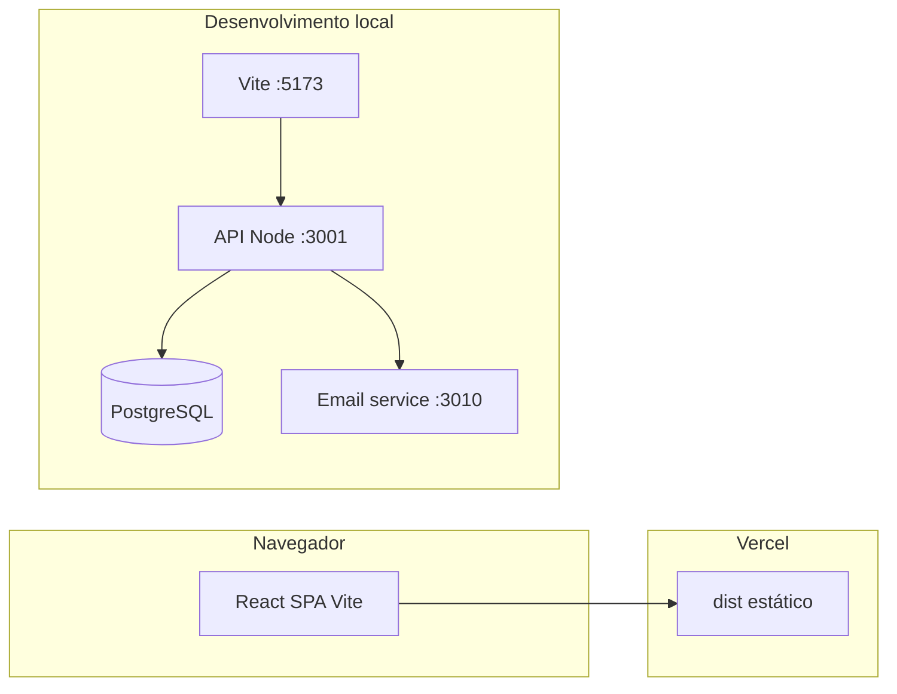

# Arquitetura

## Visão geral

- **Produção (frontend):** build `npm run build` → pasta `dist` na Vercel; rotas client-side com rewrite para `index.html`.
- **Desenvolvimento:** Vite faz proxy de `/api` para `localhost:3001`.
- **Dados:** PostgreSQL provisionado pelo repositório `infra` (Docker Compose).
- **E-mail:** serviço auxiliar no `infra` para confirmação de cadastro.

## Camadas do frontend

1. **Páginas** (`src/pages`) — composição e dados da rota.
2. **Componentes** (`src/components`) — blocos de UI sem regra de negócio pesada.
3. **Serviços** (`src/services`) — HTTP; centralizam URLs e payloads.
4. **Contexto** (`src/context`) — sessão do usuário autenticado.
5. **Utils / types** — validação e contratos.

## Camadas da API

1. **Rotas** — validação de entrada HTTP e status codes.
2. **Serviços** — regras (tokens, criptografia).
3. **db / ensureSchema** — persistência PostgreSQL.

## Testes

Playwright sobe API + Vite via `config/playwright.config.ts` e valida fluxos reais (matrícula, cadastro, e-mail) com helpers que consultam o banco quando necessário.

## Decisões de organização (2026)

- `index.html` na raiz, padrão Vite (substitui `html5/`).
- Estilos globais em `src/styles/global.css` (substitui `css3/`).
- Documentação e planejamento concentrados em `docs/`.
- Raiz limitada a entrada + `package.json` + `tsconfig.json` + `vercel.json` + README.
- Ferramentas em `config/`; histórico em `docs/CHANGELOG.md`.
